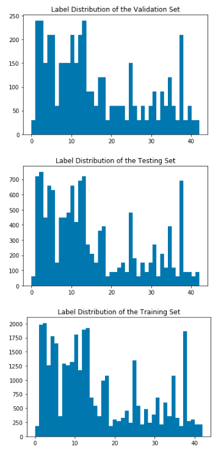

## Project: Build a Traffic Sign Recognition Program
[](http://www.udacity.com/drive)

Overview
---
This project is to use deep neural networks and Convolutional Neural Networks to classify Traffic Signs.
 A model is trained and validated so it can classify traffic sign images using the [German Traffic Sign Dataset](http://benchmark.ini.rub.de/?section=gtsrb&subsection=dataset).
Furthermore, the model is tested on images of German traffic signs that you find on the web. These images are located under [TestImages](./TestImages)

A Ipython notebook is included and it contains all the information about the projects in details.


The Project
---
The goals / steps of this project are the following:
* Load the data set
* Explore, summarize and visualize the data set
* Design, train and test a model architecture
* Use the model to make predictions on new images
* Analyze the softmax probabilities of the new images
* Summarize the results with a written report

## Data Set Summary and Exploration
### Basic Summary of the data set
The pandas library is use to calculate summary statistics of the traffic signs data set:
* The size of training set is 34799
* The size of the validation set is 4410
* The size of test set is  1263
* The shape of a traffic sign image is (32,32,3)
* The number of unique classes/labels in the data set is 43

### Exploratory Visualization of the dataset
Here is an exploratory visualization of the data set. The graph shows the traffic sign label distribution of the validation,
training and test set. However as one can see the data is not uniformly distributed, a few traffic sings has less than 200 samples
in the training set and some sign labels has more than 1250 samples.  The Traffic sign model trained in this this project
is good at identifying some signs better then others.



## Design and Test the  Model Architecture

### Preprocessed the image data
A normalize() function is used to normalize image data between -1 and 1. No further pre-processing technique were done
on the data set.
```python
def normalize(data):
    normalize_data = ((data-128.0)/128.0) -1
    return normalize_data

X_train = normalize(X_train)
X_test = normalize(X_test)
X_valid = normalize(X_valid)

```
### Model Architecture

The final model consisted of the following layers:

| Layer         		|     Description	        					| 
|:---------------------:|:---------------------------------------------:| 
| Input         		| 32x32x3 RGB image   							| 
| Convolution 5x5     	| 1x1 stride, same padding, outputs 28x28x30 	|
| RELU					|												|
| Max pooling	      	| 2x2 stride,  outputs 14x14x30 				|
| Convolution 5x5	    | 1x1 stride, same padding,output 10x10x64      |
| RELU					|												|
| Max pooling	      	| 2x2 stride,outputs 5x5x64 				    |
| Flatten				| input 5x5x64,output 1600(5*5*64)				|
| Fully Connected		| input 1600, output 1024                       | 
| RELU					|												|
| Drop out				| Probability Keep is 50%                       |
| Fully Connected       | input 1024,output 512                         |
| RELU					|												|
| Drop out				| Probability Keep is 50%                       |
| Fully Connected       | input 512,output 256                          |
| RELU					|												|
| Drop out				| Probability Keep is 50%                       |
| Fully Connected       | input 256,output number of classes 43         |


### Dependencies
This lab requires:

* [CarND Term1 Starter Kit](https://github.com/udacity/CarND-Term1-Starter-Kit)

The lab environment can be created with CarND Term1 Starter Kit. Click [here](https://github.com/udacity/CarND-Term1-Starter-Kit/blob/master/README.md) for the details.

### Dataset and Repository

1. Download the data set. The classroom has a link to the data set in the "Project Instructions" content. This is a pickled dataset in which we've already resized the images to 32x32. It contains a training, validation and test set.
2. Clone the project, which contains the Ipython notebook and the writeup template.
```sh
git clone https://github.com/udacity/CarND-Traffic-Sign-Classifier-Project
cd CarND-Traffic-Sign-Classifier-Project
jupyter notebook Traffic_Sign_Classifier.ipynb
```

### Requirements for Submission
Follow the instructions in the `Traffic_Sign_Classifier.ipynb` notebook and write the project report using the writeup template as a guide, `writeup_template.md`. Submit the project code and writeup document.

## How to write a README
A well written README file can enhance your project and portfolio.  Develop your abilities to create professional README files by completing [this free course](https://www.udacity.com/course/writing-readmes--ud777).

